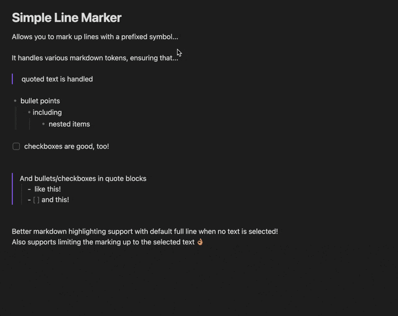

# Simple Line Marker

Work in progress plugin that enables: 
* Better text highlighting via `==` wrapping by enabling entire line-based highlighting by default
* Marking up of lines with a prefixed emoji: 🟢, 🟠, 🔴

## TODO
- [x] Add preview gif to repo readme
- [ ] Tidy up the repo, update readme with dev and contribution guidance
- [ ] Enable settings to enable user to specify N number of custom prefix text
- [ ] Publish the plugin to Obsidian community plugins!
